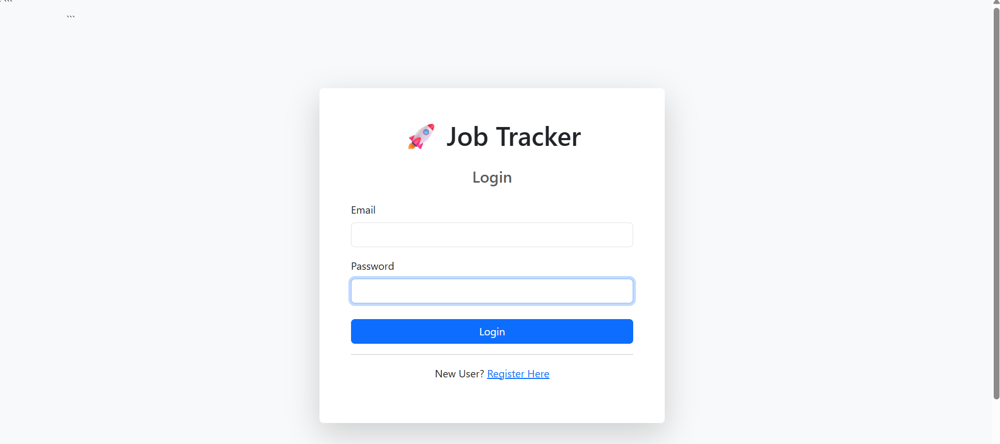
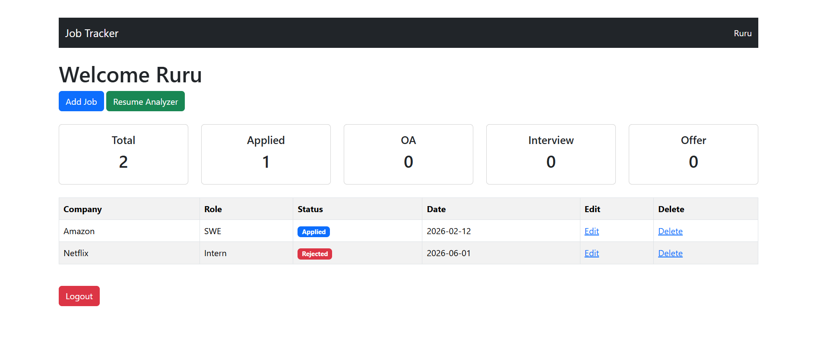
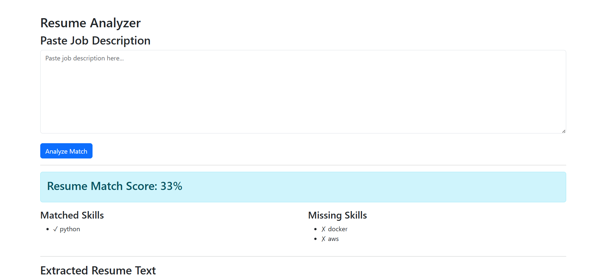

# Job Tracker & Resume Analyzer

A full-stack Flask web application that helps job seekers manage job applications, track application status, upload resumes, and analyze resume-job description matching.

## Features

* User Registration and Login Authentication
* Secure Password Hashing
* Add, Edit, and Delete Job Applications
* Track Application Status:

  * Applied
  * Online Assessment (OA)
  * Interview
  * Offer
  * Rejected
* Dashboard with Application Statistics
* Resume PDF Upload
* Resume Text Extraction using PyPDF2
* Resume Match Score Analysis
* Skill Detection from Resume
* Responsive Bootstrap User Interface

## Tech Stack

* Python
* Flask
* Flask-SQLAlchemy
* Flask-Login
* SQLite
* HTML
* CSS
* Bootstrap
* PyPDF2

## Installation

Clone the repository:

```bash
git clone <your-repository-url>
cd job-tracker
```

Install dependencies:

```bash
pip install -r requirements.txt
```

Run the application:

```bash
python app.py
```

Open in browser:

```text
http://127.0.0.1:5000
```

## Project Structure

```text
job-tracker/
│
├── app.py
├── requirements.txt
├── templates/
│   ├── dashboard.html
│   ├── login.html
│   ├── register.html
│   ├── add_job.html
│   ├── edit_job.html
│   ├── resume.html
│   └── analyze.html
│
├── static/
└── uploads/
```
## Screenshots

### Login Page



### Dashboard



### Resume Analyzer


## Future Improvements

* Chart.js Dashboard Visualization
* CSV Export of Applications
* Job Search and Filtering
* Email Follow-Up Reminders
* Deployment on Render

## Author

Prayash Barman

B.Tech Computer Science & Engineering
Tezpur University
